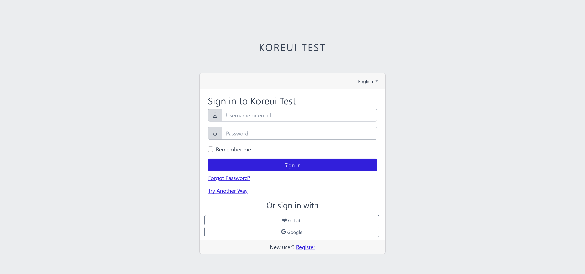
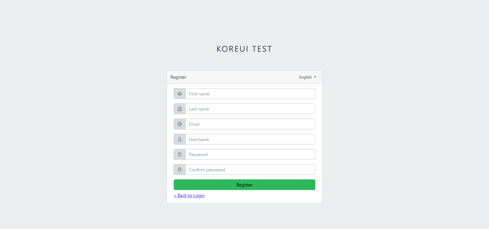
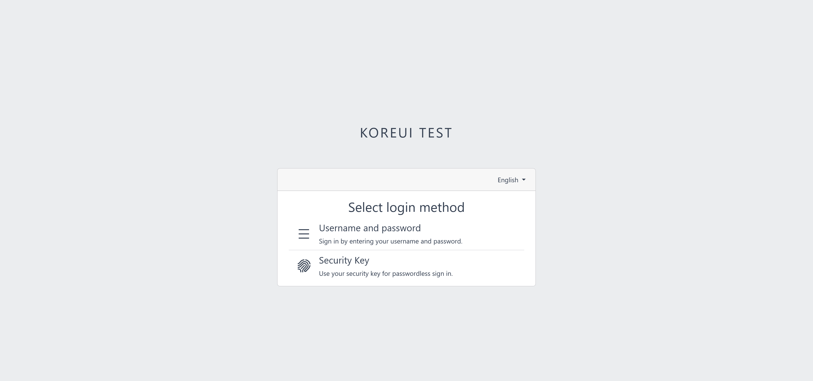
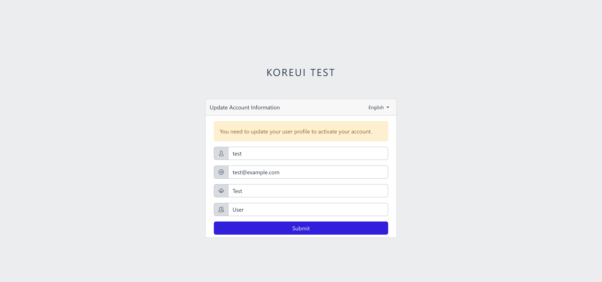
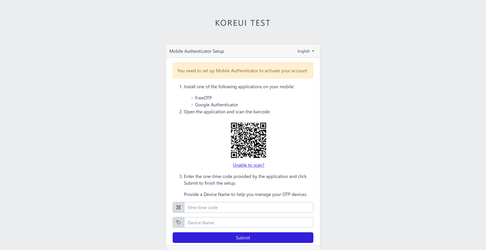
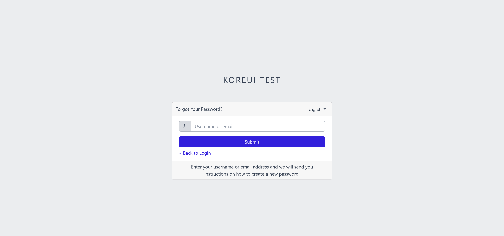
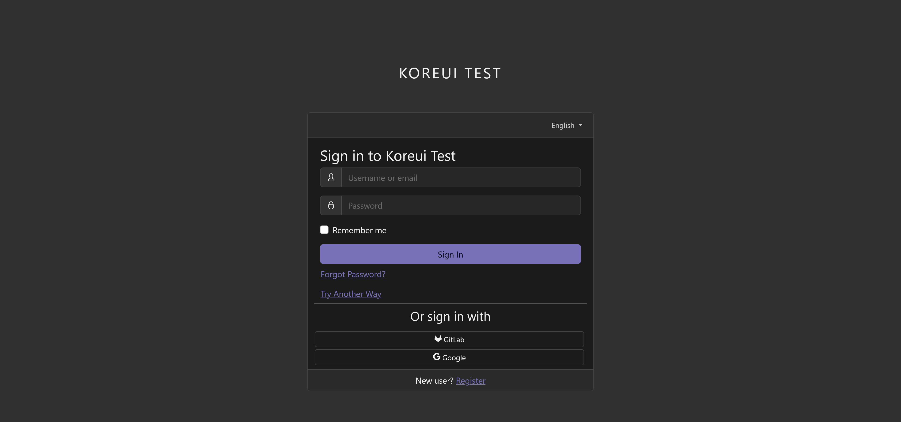
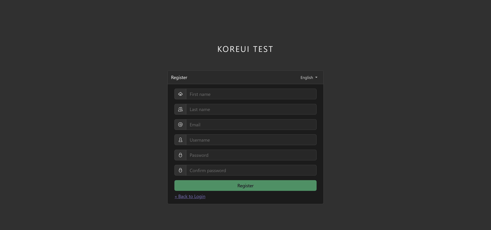

# KOREUI

**Koreui** is a [CoreUI](https://coreui.io/) based [Keycloak](https://www.keycloak.org/) login theme.

Icon pack: [CoreUI Icons](https://coreui.io/icons/)

:boom: NEW: Dark mode :boom:

Login page

### Installation

Download `koreui-<version>.jar` from [Releases](https://github.com/nkelemen18/koreui/releases), and put into providers folder of your Keycloak installation.
see: [Deploying themes](https://www.keycloak.org/docs/latest/server_development/#deploying-themes)

Tested with Keycloak `20.0.z`

### Refactored pages

- [x] delete-account-confirm.ftl
- [x] error.ftl
- [ ] frontchannel-logout.ftl
- [ ] idp-review-user-profile.ftl
- [x] info.ftl
- [x] login.ftl
- [x] login-config-totp.ftl
- [x] login-idp-link-confirm.ftl
- [ ] login-idp-link-email.ftl
- [x] login-oauth2-device-verify-user-code.ftl
- [x] login-oauth-grant.ftl
- [x] login-otp.ftl
- [x] login-page-expired.ftl
- [x] login-password.ftl
- [ ] login-recovery-authn-code-config.ftl
- [ ] login-recovery-authn-code-input.ftl
- [x] login-reset-password.ftl
- [x] login-update-password.ftl
- [x] login-update-profile.ftl
- [x] login-username.ftl
- [x] login-verify-email.ftl
- [ ] login-x509-info.ftl
- [x] logout-confirm.ftl
- [x] register.ftl
- [ ] register-user-profile.ftl
- [ ] saml-post-form.ftl
- [x] select-authenticator.ftl
- [x] template.ftl
- [x] terms.ftl
- [ ] update-email.ftl
- [ ] update-user-profile.ftl
- [ ] user-profile-commons.ftl
- [x] webauthn-authenticate.ftl
- [x] webauthn-error.ftl
- [x] webauthn-register.ftl

### Pictures

Registration page

Select authenticator page

Update profile page

Configure One-Time-Password page

Forgot password page

#### Dark Mode

Login page

Registration page
